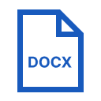
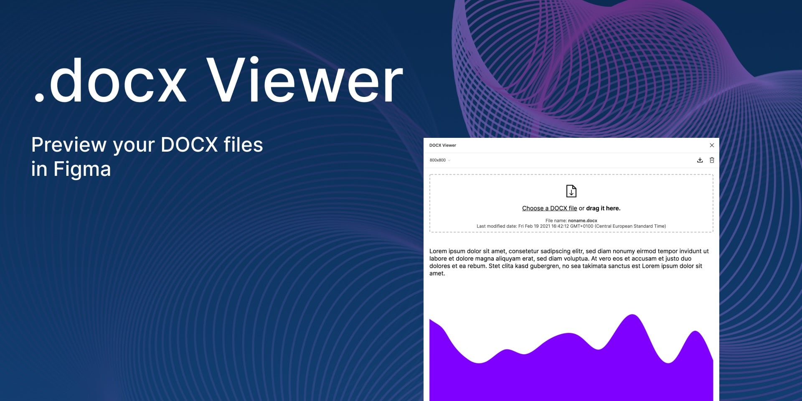

#  DOCX Viewer (Figma Plugin)

Preview your <b>DOCX</b> files in Figma.

<b>How to use:</b>
1. Right Click -> Plugins -> DOCX Viewer
2. Click on button "Choose a DOCX file"
3. Select your .docx

Optional: 
- save your preview in cache
- clear cache
- change window size
- adding images to Figma by clicking on the image

# Compile with Webpack
The main plugin code is in `src/code.ts`. The HTML for the UI is in `src/ui.html`, while the embedded JavaScript is in `src/ui.ts`.

These are compiled to files in `dist/`, which are what Figma will use to run your plugin.

To build:

    $ npm install
    $ npx webpack

For more info, see: https://www.figma.com/plugin-docs/bundling-webpack/